# Smile Fotilo — Comprehensive Website Audit & Architecture Report

**Date:** June 11, 2026  
**Audited By:** Antigravity (AI Coding Assistant)  
**Workspace:** `smile-fotilo` Next.js Application  

---

## 1. Studio Identity & Positioning

**Smile Fotilo** is a premium, founder-led web design, SEO, and AI automation studio run by **Ashraf Kamal**. 
* **Business Model:** Solopreneur-direct agency. The founder handles client discovery, design (Figma), front-end/back-end development, deployment, SEO, and ongoing support.
* **Target Audience:** 
  1. **Local Businesses & Clinics** in Uttar Pradesh and NCR (Gonda, Lucknow, Ayodhya, Noida, Greater Noida) seeking local search traffic, Google Business optimization, and client inquiry automation.
  2. **International/US Small Businesses** (e.g., Curbit in Oregon) seeking premium design and development at competitive offshore rates.
* **Communication Tone:** Honest, direct, and collaborative. Avoids generic corporate "we/our" plurals on marketing pages, focusing instead on founder-led accountability ("I build," "meet the developer").

---

## 2. Design System & Aesthetics

The application employs a **2026-grade premium agency aesthetic** featuring rich dark elements, glassmorphism, and subtle color accents.

### Color Palette
* **Base Background:** Deep indigo/black (`#020617` for sections like Services/GlobalReach/Footer, `#0a0118` for Home/Contact/FAQ/Work, and `#0a0a0b` for Portfolio).
* **Card & Raised Surfaces:** Semi-transparent dark slate (`#0F172A/50` or `#1E293B`) with glassmorphism backdrop blurs.
* **Accents:** 
  * Indigo/Violet (`#6366f1` / `#8b5cf6`) — Primary accents, button triggers, and ambient glowing backgrounds.
  * Cyan/Sky Blue (`#06b6d4` / `#38bdf8`) — Highlight accents for SaaS/recurring products (like Growth Autopilot).
  * Emerald Green (`#22c55e` / `#25D366`) — Strictly reserved for WhatsApp CTA buttons and success markers.
* **Borders:** Thin, high-contrast borders (`border-white/10` or `border-indigo-500/20`) that glow on hover.

### Typography
* Font family: Sans-serif (configured with Geist/sans-serif defaults in Tailwind).
* Scales range from display headings (`text-6xl md:text-7xl`) for heroes down to metadata captions (`text-xs font-semibold uppercase tracking-widest`).

### Animations & Micro-interactions
* Powered by `framer-motion` for smooth, scroll-triggered entry fades and hover scale transitions (e.g., cards shifting slightly upward `y: -5` or `y: -10`).
* Ambient background glows (blurred radial gradients) floating behind sections to create visual depth and a "spatial" feel.

---

## 3. Information Architecture & Sitemap

Below is the structured layout of all routes on `smilefotilo.com`, illustrating the visitor conversion funnel (Home → Services → Proof → Price → Contact).

```mermaid
graph TD
    Home["Home (/)"]
    
    %% Marketing Spine
    Services["Services (/services)"]
    Work["Work (/work)"]
    Pricing["Pricing (/pricing)"]
    About["About (/about)"]
    Contact["Contact (/contact)"]
    
    %% Detail / Child pages
    WebDesign["Web Design (/services/web-design)"]
    SEO["SEO (/services/seo)"]
    Branding["Branding (/services/branding)"]
    Autopilot["Growth Autopilot (/services/clinic-growth-autopilot)"]
    GrowthOS["AI Growth OS (/services/ai-growth-os)"]
    
    CaseStudies["Case Studies (/work/[slug])"]
    Portfolio["Portfolio (/portfolio)"]
    
    Blog["Blog (/blog)"]
    BlogCat["Blog Categories (/blog/category/[category])"]
    BlogPost["Blog Posts (/blog/[slug])"]
    
    Tools["Free Tools (/tools)"]
    AuditTool["Website Audit (/tools/website-audit)"]
    FactoryTool["Website Factory (/tools/website-factory)"]
    SEOTool["SEO Content (/tools/seo-content)"]
    
    Locations["Locations (/locations)"]
    CityPages["City Landing Pages (/locations/[city])"]
    GlobalPage["Global US Page (/locations/global)"]
    
    Legal["Legal Pages (/privacy, /terms, /cookie-policy, /disclaimer)"]
    
    %% App Surfaces (Noindex)
    AppShell["App Shell (/builder, /login, /portal, /admin)"]
    Marketplace["Marketplace (/marketplace)"]
    
    %% Relationships
    Home --> Services
    Home --> Work
    Home --> Pricing
    Home --> About
    Home --> Contact
    
    Services --> WebDesign
    Services --> SEO
    Services --> Branding
    Services --> Autopilot
    Services --> GrowthOS
    
    Work --> CaseStudies
    Work --> Portfolio
    
    Blog --> BlogCat
    Blog --> BlogPost
    
    Tools --> AuditTool
    Tools --> FactoryTool
    Tools --> SEOTool
    
    Locations --> CityPages
    Locations --> GlobalPage
    
    Home --> Legal
    Home --> AppShell
    Home --> Marketplace
```

### Internal Linking & Conversion Flow
* **Service Detail Pages** link directly to relevant Case Studies, Pricing, and a dedicated contact option (`/contact?plan=...`).
* **Case Studies** link back to the service that produced them, validating client proof and funneling readers to `/contact`.
* **Location Pages** interlink with core services (Web Design, SEO) and sibling cities, boosting local SEO authority.
* **Blog Posts** list related articles, link to their category hub, and contain at least one contextual service link.
* **Global Header / Footer** provide access to all main marketing pages, service areas, and legal documentation.

---

## 4. Detailed Page Audit

### 4.1. Home Page (`/`)
* **File Locations:** `app/page.tsx`, `app/HomePageClient.tsx`
* **Sections:**
  * **Hero:** Displays the main title ("Websites & Local SEO that bring you customers"), introduces Ashraf Kamal, lists target local regions, and triggers CTAs (WhatsApp and "See Client Results").
  * **Services Grid:** Summarizes 5 core services with icons.
  * **AI Local Business OS:** Features local business integrations, reviews, and reminders.
  * **Featured Works:** Showcases selected client projects (PulseKart, OrderFlow, Creator Agent Toolbox, Veloria Vault).
  * **Testimonials:** Displays client reviews.
  * **Global Reach:** Promotes remote work for US and Indian clients (links to `/locations/global`).
  * **FAQ:** Addresses cost, timeline, and support queries.
  * **Pricing Selector:** Toggles between Project Delivery and monthly AI Growth Ops.
  * **Contact Section:** Renders a contact form and links to support info.

### 4.2. About Page (`/about`)
* **File Locations:** `app/about/page.tsx`, `app/about/AboutPageClient.tsx`
* **Purpose:** Acts as the primary E-E-A-T (Experience, Expertise, Authoritativeness, Trustworthiness) anchor.
* **Content:** Covers Ashraf's solopreneur journey, explains the name "Smile Fotilo" ("Fotilo" means camera in Esperanto, emphasizing visual roots), and hosts a personal "Founder's Note."

### 4.3. Services Hub (`/services`) & Detail Pages
* **File Locations:** `app/services/page.tsx`, `app/services/[service-name]/page.tsx`
* **Pages:**
  * **Services Index:** A 5-card grid summarizing offerings.
  * **Web Design & Development (`/services/web-design`):** Focuses on WordPress, WooCommerce, and Next.js custom builds starting at ₹15,999. Includes process stages (Discovery → Launch) and technical FAQs.
  * **SEO & GEO (`/services/seo`):** Outlines strategies for Google Search, AI Overviews, Local SEO, and Featured Snippets.
  * **Brand Identity (`/services/branding`):** Covers brand guidelines, logo systems, packaging, and visual identity.
  * **Growth Autopilot (`/services/clinic-growth-autopilot`):** Specialized clinic workflow automation (missed-call alerts, T-24h text reminders, Google review flows) at ₹12,000/month.
  * **AI Local Business OS (`/services/ai-growth-os`):** Scaled automation stack for multi-location businesses at ₹30,000/month.

### 4.4. Work & Case Studies (`/work`, `/work/[slug]`, `/portfolio`)
* **File Locations:** `app/work/page.tsx`, `app/work/WorkPageClient.tsx`, `app/work/[slug]/page.tsx`, `app/portfolio/page.tsx`
* **Pages:**
  * **Selected Works Index:** Grid of 6 core case studies:
    1. *PulseKart:* Pharma POS & inventory management system.
    2. *Kapda Factory:* Garment manufacturer ERP and e-commerce.
    3. *OrderFlow:* Real-time logistics tracking tablet app & dashboard.
    4. *Curbit:* Smart city service reservation site for an Oregon (US) client.
    5. *Veloria Vault:* Premium e-commerce site for luxury leather goods.
    6. *StoryBook Weddings:* Wedding photography portfolio built for a client in Lucknow.
  * **Case Study Details (`/work/[slug]`):** Static-generated pages with project outcomes, tech details, and CTAs.
  * **Ashraf's Portfolio (`/portfolio`):** Merges personal details, local UP track record, and a live GitHub repo list pulled dynamically from `api.github.com/users/ak1458/repos`.

### 4.5. Pricing Page (`/pricing`)
* **File Locations:** `app/pricing/page.tsx`, `app/pricing/PricingPageClient.tsx`, `app/data/pricing.ts`
* **Purpose:** Single source of truth for pricing terms across the entire site.
* **Pricing Models:**
  1. *Launch (₹25,000 / project):* 5-page responsive site, basic SEO, WhatsApp CTA, Google Business setup.
  2. *Growth (₹65,000 / project):* E-commerce, custom dashboard, advanced analytics, 3 months support.
  3. *Premium (₹1,25,000+ / project):* Custom integrations, advanced SEO roadmap.
  4. *Automation Setup (₹20,000 / one-time):* Integration build, prompt tuning, and workflow mapping.
  5. *Growth Autopilot (₹12,000 / month / location):* Clinic/local business missed-call and reminder workflows.
  6. *Multi-Branch OS (₹30,000 / month):* Scaled multi-branch dashboard and outcomes monitoring.

### 4.6. Blog System (`/blog`)
* **File Locations:** `app/blog/page.tsx`, `app/blog/listing.tsx`, `app/blog/[slug]/page.tsx`, `app/blog/category/[category]/page.tsx`, `app/data/blogs/*`
* **Architecture:** 53 posts split across 5 static files (`webDesignPosts`, `seoPosts`, `businessPosts`, `ecommerceBrandingPosts`, `techTrendsPosts`) to separate listing metadata from server-rendered content.
* **Routes:**
  * `/blog`: Server component showing recent articles and categories.
  * `/blog/category/[category]`: Category-filtered hubs (e.g., Web Design, SEO, Business, Tech Trends).
  * `/blog/[slug]`: Markdown-prose post reader with read-time, tags, and author profiles.

### 4.7. Interactive Tools (`/tools`)
* **File Locations:** `app/tools/page.tsx`, `app/tools/website-audit`, `app/tools/website-factory`, `app/tools/seo-content`
* **Flagship Magnet:** `/tools/website-audit` — performs real-time basic web audit checks (SEO, speed, links) and acts as a lead capture form.
* **Supporting Tools:** `/tools/website-factory` (pre-sales blueprint generator) and `/tools/seo-content` (funnel for SEO copy generation).

### 4.8. Local SEO & City Pages (`/locations`)
* **File Locations:** `app/locations/page.tsx`, `app/locations/LocationAreaTemplate.tsx`, `app/data/locations.ts`
* **Target Cities:** Gonda, Ayodhya, Lucknow, Greater Noida, Noida, and a Global page for the USA.
* **Architecture:** Static pages loaded via `LocationAreaTemplate` fed by structured JSON data in `app/data/locations.ts`. This allows rapid generation of new local landing pages for search indexing (targeting keywords like "Web designer Lucknow", "SEO services Noida") without copying codebase files.

### 4.9. Contact Page (`/contact`)
* **File Locations:** `app/contact/page.tsx`, `app/components/ContactForm.tsx`
* **Funnel Hub:** Integrates a contact form alongside telephone, email, physical address, and instant WhatsApp chat links. Pre-fills form fields based on URL parameters (e.g., `/contact?plan=launch`).

---

## 5. SEO Architecture & Meta Integration

### 5.1. Meta Tags & Social Previews
* Each main route exports a static `Metadata` object containing canonical URLs, target keywords, and page-specific title/description tags.
* OpenGraph (OG) and Twitter card configurations are unified, pointing to a dynamic OG cover generator endpoint (`/og?title=...&subtitle=...`) to display premium visual previews on social platforms.

### 5.2. Structured Data (JSON-LD)
* Dynamic scripts output schema markup at the bottom of pages via the `<StructuredData />` wrapper:
  * **LocalBusiness:** Implemented for city pages detailing founder NAP (Name, Address, Phone) details.
  * **FAQPage:** Injected dynamically into Home and city detail pages, matching the visible FAQ section text.
  * **Article:** Rendered on individual blog posts for proper author attribution and publication dates.
  * **Service:** Configured on services pages (e.g., `offersFrom`, `areaServed`).
  * **ContactPage / BreadcrumbList:** Crawl-friendly schemas mapping navigation levels.

---

## 6. Technical Stack & Integrations

The codebase is built on a modern serverless JavaScript framework and integrated with third-party APIs.

* **Core Framework:** Next.js 16 (App Router) with React 19 and Webpack compilation options.
* **Component Styling:** Tailwind CSS v4 coupled with custom classes in `app/globals.css`.
* **State & Icons:** `react-icons` (Material Design, FontAwesome) and `framer-motion` for page-level state and design animations.
* **Database/Backend:** Supabase integration for app storage, client portals, and user roles.
* **API Integrations:**
  * **GitHub API:** Fetches the repository list for `/portfolio` dynamically (revalidated hourly).
  * **OpenRouter API:** Integrates free model rotations (like GLM-4.5-Air) to power the "Echo Assistant" chatbot, qualified via system prompt contexts.
  * **Razorpay:** Gateway integration for processing local Indian transactions.
  * **SendGrid/Resend/Nodemailer:** Handles automated client emails and contact form notifications.
